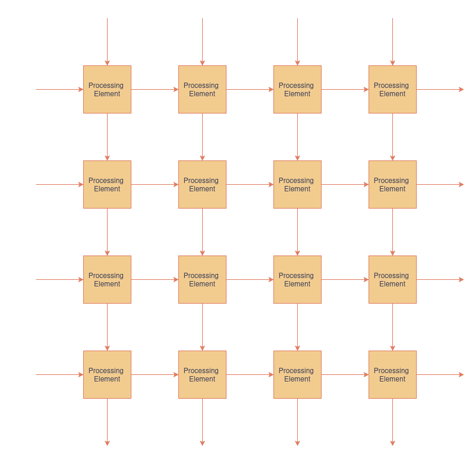

# Introduction
This project implements a parameterised matrix multiplication accelerator based on a systolic array architecture. By exploiting parallel multiply-accumulate (MAC) operations, the accelerator performs matrix multiplication with significantly lower latency than a purely sequential implementation. The design is written primarily in SystemVerilog to take advantage of array ports and parameterisation.

## What are systolic arrays?
A systolic array is an array of processing elements. Each processing element stores its accumulated partial sum locally before forwarding operands to neighbouring processing elements. Data propagates through the array in a pipelined fashion, allowing all processing elements to operate concurrently once the array is filled. In this case, the processing elements consist of multiply-accumulate (MAC) modules. 



*An example of a 4 x 4 systolic array - note how inputs are received from the north and west and outputs are sent to the south and east*

The parameter N defines the dimensions of the systolic array. As long as N is at least as large as the largest input matrix dimension, smaller matrices can be zero-padded before computation. Zero-padding does not affect the mathematical result while allowing a single hardware implementation to support multiple matrix sizes.

# Design Description
## Features
- User-adjustable data width and matrix size.
- Self-checking SystemVerilog testbenches verify functionality across multiple matrix sizes and parameter configurations.
- Takes advantage of parallel processing to significantly reduce computation time by executing many multiply-accumulate operations simultaneously.
## Modules
The module hierarchy is as follows:
```
accelerator.sv
├── controller.v
└── systolic_array.sv
    └── processing_element.v
```
- **Accelerator** - the top level module that connects the control logic and the systolic array. It also features logic to prepare the input matrix for the systolic array.
- **Systolic Array** - an N x N grid of processing elements.
- **Controller** - a finite state machine (FSM) featuring three states: IDLE, COMPUTE and DONE. 
- **Processing Elements** - the building blocks of the systolic array, each performing MAC operations.

**Accelerator I/O:**
| Name     | Input/Output | Width     | Function                         |
| -------- | ------------ | --------- | -------------------------------- |
| clk      | Input        | 1         | Clock                            |
| rst      | Input        | 1         | Reset                            |
| ready    | Input        | 1         | Initiates computation               |
| a        | Input        | Parameter         | Flat version of input matrix a   |
| b        | Input        | Parameter         | Flat version of input matrix b   |
| result   | Output       | Parameter | Flat version of resulting matrix |
| finished | Output       | 1         | Signals end of computation       |

# Future Work
Some things I'd like to add later if I find the time:
- Support for rectangular matrices without zero-padding
- Signed (two's complement) and floating-point arithmetic support
- FPGA implementation and resource utilisation analysis
